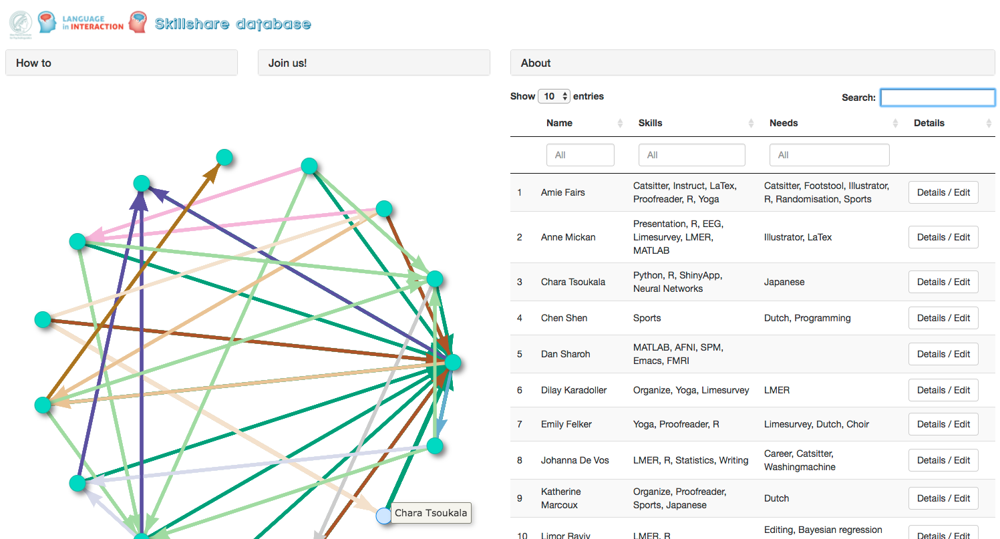

# Skillshare app

This project aims to create a knowledge database for PhD students affiliated with the IMPRS and/or Language in Interaction.




Before running the app, make sure you have the required libraries installed:

```
Rstudio install_packages.r
```

To run the app:

```
library(shiny)
runApp()
```

The prototype can be found here: https://imprs.shinyapps.io/imprs_reciprocity/ 
```
username: imprs
password: sharingiscaring
```
